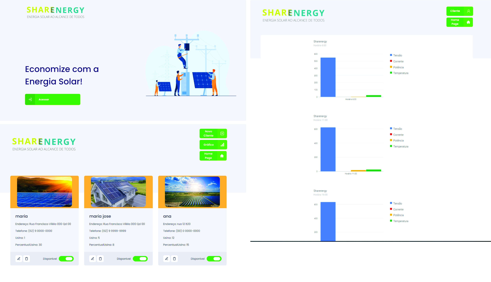

## Layout da aplicação

## Link do Vídeo
https://youtu.be/3q2b0hMS1P4

## Clonar o repositório:
https://github.com/DIOGO-MOTA/Sharenergy.git

## Execução de Projeto
yarn
yarn start

## Utilizando uma fake API

Antes de tudo, para que você tenha os dados para exibir em tela, foi criado um arquivo que você poderá utilizar como fake API para te prover esses dados.

Para isso, foi deixado instalado no seu package.json uma dependência chamada json-server, e um arquivo chamado server.json que contém os dados para uma rota /client é /hours. Para executar esse servidor você pode executar o seguinte comando:

  yarn json-server server.json -p 3333

## Dependências

    "@types/node": "^12.0.0",
    "@types/react": "^16.9.0",
    "@types/react-dom": "^16.9.0",
    "@types/react-modal": "^3.10.5",
    "@unform/core": "^2.1.0",
    "@unform/web": "^2.1.0",
    "axios": "^0.19.2",
    "react": "^16.13.1",
    "react-dom": "^17.0.1",
    "react-google-charts": "^3.0.15",
    "react-hooks-paginator": "^0.4.4",
    "react-icons": "^3.10.0",
    "react-modal": "^3.11.2",
    "react-router-dom": "^5.2.0",
    "react-scripts": "3.4.1",
    "styled-components": "^5.1.0",
    "typescript": "~3.7.2",

## Funcionalidades da aplicação

1. Lista os clientes da API.

2. Adicionar novos clientes na API:

3. Edita clientes na API:

4. Remover clientes da sua API:

5. Alterar disponibilidade dos clientes da sua API:

6. Lista os dados da rota /hours é plota em um gráfico de uma variável de interesse.

7. Paginação ao listar os dados da rota /hours

